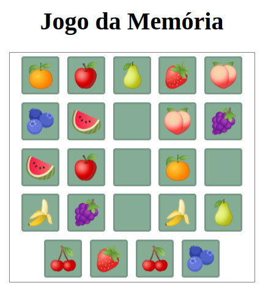
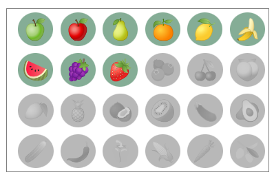

# Jogo da Memória
🎮 Um jogo divertido para desafiar sua memória, feito com HTML, CSS e JavaScript!


## Índice

- [Introdução](#introdução)
- [Como Iniciar o Jogo](#como-iniciar-o-jogo)
- [Como Jogar](#como-jogar)
<!-- - [Licença](#licença) -->

## Introdução

Jogo Memória é um clássico jogo de memória onde os jogadores precisam combinar pares de cartas. Ele é projetado para ser divertido e educativo, ajudando a melhorar a  	memória e a concentração.


## Como Jogar

1. Clique em uma carta para virá-la.
2. Vire duas cartas por vez, até encontrar um par.
3. Encontre todos os pares para avançar um nível.

A cada nível concluído, uma nova fruta é desbloqueada e a dificuldade do jogo aumenta!



## Como Iniciar o Jogo
### Opção 1: Jogue Online
Clique no link abaixo para jogar diretamente no navegador utilizando HTML Preview:

[Jogar Agora com HTML Preview](http://htmlpreview.github.io/?https://github.com/MikaelOliveiraDev/jogo-memoria/blob/main/index.html)

### Opção 2: Execute Localmente

Para rodar o jogo localmente, siga estas etapas:

- Clone o repositório:

```bash
git clone https://github.com/MikaelOliveiraDev/jogo-memoria.git
```

- Abra o arquivo ```index.html``` no seu navegador.
